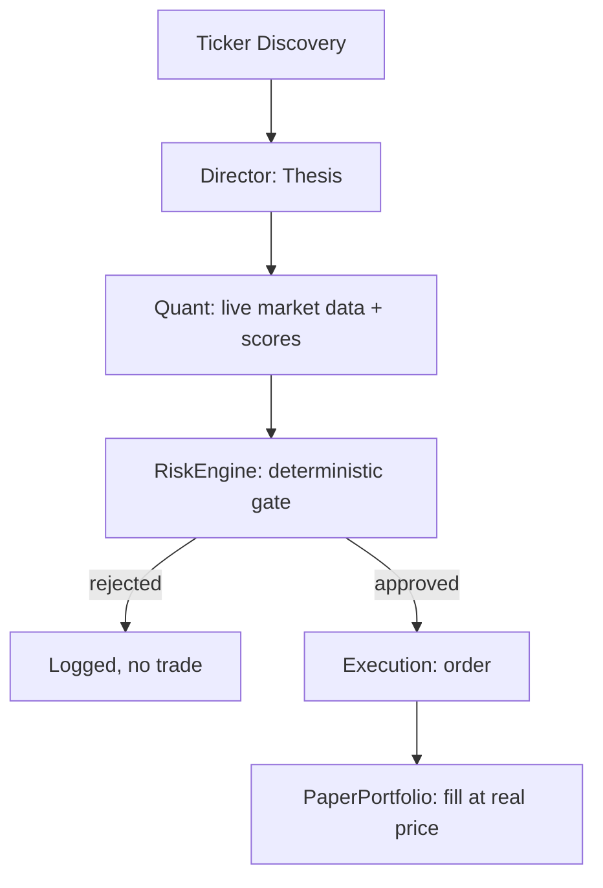

# AutoHedge

AutoHedge is a paper-trading research pipeline that chains a small set of
LLM agents — Director, Quant, Execution — with a **deterministic, code-based
risk engine** and a local paper-trading ledger. It analyzes a ticker,
grounds its analysis in real market data, and simulates a fill against a
JSON portfolio file at the real quoted price. Nothing here signs or
submits a real transaction unless you explicitly opt into that (see
"Live execution" below).

---

## What this actually does

1. **Ticker discovery**: an agent extracts relevant tickers from your task.
2. **Thesis (Director agent)**: produces a structured long/short thesis with
   a confidence score and supporting factors.
3. **Quant analysis (Quant agent)**: calls a real market-data tool
   (Yahoo Finance) for current price/volume, and returns technical/
   volatility/probability scores grounded in that data — not hallucinated
   numbers.
4. **Risk gate (`autohedge/risk_engine.py`, plain Python, not an LLM)**:
   enforces max position size, max total exposure, max open positions,
   a daily loss limit, and a minimum probability threshold, computed from
   your actual paper portfolio equity. A trade that fails any check is
   rejected before an execution order is ever generated.
5. **Execution order (Execution agent)**: converts an *approved* risk
   decision into concrete order parameters. The order is validated against
   the risk decision in code (side, size) before being allowed through.
6. **Paper fill (`autohedge/portfolio.py`)**: records the trade in
   `outputs/portfolio.json` at the real fetched market price, updates cash
   and positions, and persists across runs.

All of this is unit-tested (`tests/`) with the LLM calls mocked out, so the
control flow — risk rejection, position sizing, order validation — is
verified independent of any API key.

## What this does NOT do

- It does not place real trades by default, on Solana or anywhere else.
- The Solana swap tools (`autohedge/tools/ultra_tools.py`) are real and
  functional — they sign a versioned transaction with a `SOLANA_PRIVATE_KEY`
  and submit it to Jupiter Ultra — but they are **not** wired into the
  agent pipeline. See "Live execution" below for the one explicit,
  opt-in way to use them.
- It is not an "institutional-grade" system. It's a small, single-focus
  research tool: good for generating and stress-testing trade ideas
  against a real risk budget, not for unattended real-money trading.

---

## Quick Start

### Installation

```bash
pip install -r requirements.txt
pip install -e .
```

### Environment Variables

```bash
# Required for the LLM agents (default provider is OpenAI)
OPENAI_API_KEY=

# Optional: raises Jupiter API rate limits for the (unwired) live-trading tools
JUPITER_API_KEY=

# Only needed if you explicitly call autohedge.live.execute_live_swap yourself
SOLANA_PRIVATE_KEY=
```

### Switching LLM provider (e.g. to Gemini)

All agent calls route through `swarms` -> LiteLLM, which already supports
other providers by model name prefix. To use Gemini instead of OpenAI,
set:

```bash
GEMINI_API_KEY=
AUTOHEDGE_MODEL=gemini/gemini-3.5-flash
AUTOHEDGE_LIGHT_MODEL=gemini/gemini-3.5-flash
```

No code changes needed — `autohedge/workers.py` reads `AUTOHEDGE_MODEL`
(used by Director/Quant/Execution/Risk/Ticker-Discovery) and
`AUTOHEDGE_LIGHT_MODEL` (used by the Sentiment agent) at import time.

See `.env.example` for the full list.

### Basic Usage

```bash
autohedge
```

This starts an interactive REPL:

- `<task>` — e.g. `Analyze NVDA for a swing trade` runs the full pipeline
  and paper-fills any approved trade.
- `portfolio` — shows paper cash, equity, and open positions.
- `history` — shows recent paper trades.

Or from Python:

```python
from autohedge import AutoHedge

system = AutoHedge(starting_cash=100_000.0)
results = system.run("Analyze NVDA for a swing trade")
```

Each ticker's result includes the thesis, quant analysis, risk decision
(with rejection reasons if declined), and the fill if one occurred.

### Web dashboard

```bash
pip install -r ui/requirements.txt
streamlit run ui/app.py
```

Opens at `http://localhost:8501` with four tabs: Run Pipeline (trigger a
real cycle and see thesis/quant/risk/execution/fill per ticker),
Portfolio, History, and Live Trading. The Live Trading tab is a thin
front end over `autohedge/live.py` — it only becomes usable if
`AUTOHEDGE_ENABLE_LIVE_TRADING=I_UNDERSTAND_THIS_IS_REAL_MONEY` is
already set in the environment the Streamlit server was launched from
(the UI cannot set this itself), and the execute button stays disabled
until you type an exact confirmation phrase.

---

## Risk limits

Defaults live in `autohedge/risk_engine.py::RiskLimits` and are deliberately
conservative:

| Limit | Default |
|---|---|
| Max position size | 10% of equity |
| Max total exposure | 60% of equity |
| Max open positions | 5 |
| Daily loss limit | 3% of start-of-day equity |
| Min probability score | 0.55 |

Pass a custom `RiskLimits` instance to `AutoHedge(risk_limits=...)` to
change these.

---

## Live execution (opt-in, use at your own risk)

`autohedge/live.py` exposes `execute_live_swap()`, which wraps the real
Jupiter Ultra signing/execution flow in `autohedge/tools/ultra_tools.py`.
It is never called automatically — you have to import and call it
yourself, with `AUTOHEDGE_ENABLE_LIVE_TRADING=I_UNDERSTAND_THIS_IS_REAL_MONEY`
set in your environment. There is no other path to real execution in this
codebase, and no risk limits from `risk_engine.py` apply to it — you are
fully responsible for sizing and safety if you use it.

---

## Architecture



---

## Testing

```bash
python -m unittest discover -s tests -v
```

Tests mock the LLM agents and network calls; no API key is required to run
them (a placeholder `OPENAI_API_KEY` is enough to construct the agents).

---

## Contributing

Contributions are welcome. See [Contributing Guidelines](CONTRIBUTING.md) for details.

1. Fork the repository
2. Create a feature branch (`git checkout -b feature/AmazingFeature`)
3. Commit changes (`git commit -m 'Add some AmazingFeature'`)
4. Push to the branch (`git push origin feature/AmazingFeature`)
5. Open a Pull Request

---

## License

MIT License. See [LICENSE](LICENSE) for details.

---

## Acknowledgments

- [Swarms](https://swarms.ai) for the AI agent framework

---

## Support

- Issue Tracker: [GitHub Issues](https://github.com/The-Swarm-Corporation/AutoHedge/issues)

---

AutoHedge by [The Swarm Corporation](https://github.com/The-Swarm-Corporation)
